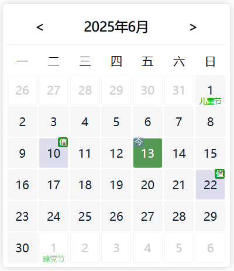

# rtian-calendar

## 日历组件

 使用方法：默认显示当前月份,可以设置 options.date显示指定日期月份

 ```html
<div id="calendar"></div>
```



1. 默认显示当前月份
2. 显示指定日期的月份
3. 是否显示公共节假日
4. 自定义节假日（值班日）
5. 自定义点击日期事件：内置参数：date，当前日期字符串
6. 自定义切换月份事件：内置参数：date，当前日期字符串
7. 其他属性：自定义日历组件宽度、高度，设置星期起始日

 ```JavaScript
 let calender = new rtianCalender('#calendar');
 calender.render();
```

 或：

 ```JavaScript
 let calender = new rtianCalender();
 calender.render('#calendar');
```

可以自定义点击日期事件和日历月份切换事件

 ```JavaScript
 let calender = new rtianCalender();
 calender.render({
      elem: '#calendar',
      showPbulicHoliday: true,
      date:'2025-05-01',
      weekstart:0,
      width:400,
      height:500,
      holiday:[],
      done: function(dt){
          console.log(dt)
      },
      change: function(dt){
         //自定义事件
      }
 });
```

### 示例文件

```html
<link rel="stylesheet" href="rtianCalendar.css">
<script src="rtianCalendar.js"></script>
<div id="calendar"></div>
        <div id="res"></div>
        <script>
            const resdom = document.querySelector('#res');
            const calender = new rtianCalender('#calendar').render({ showPublicHoliday: true });
            var holiday = {}

            //模拟异步获取自定义节假日
            async function getHolidays(ym) {
                let count = ~~(Math.random() * 5 + 3)
                let arr = []
                for (let i = 0; i < count; i++) {
                    let d = ~~(Math.random() * 28 + 1)
                    arr.push(`${ym}-${d.toString().padStart(2, '0')}`)
                }
                arr = [...new Set(arr)]
                return new Promise((resolve, reject) => {
                    setTimeout(() => {
                        resolve(arr)
                    }, 300);
                })
            }
            //获取指定月份节假日，并渲染到日历
            getHolidays('2025-06').then(data => {
                calender.renderMaker('2025-06-10,2025-06-22');
            })

            //自定义事件：切换月份时，获取当前月份的节假日，并渲染到日历
            calender.change = function (date) {
                let ym = date.slice(0, 7)
                getHolidays(ym).then(data => {
                    calender.renderMaker(data);
                })
                //其他代码
                resdom.innerHTML = 'change事件:切换到' + date;
            }
            //自定义事件：切换到指定日期
            calender.done = function (date) {
                resdom.innerHTML = 'done事件:切换到' + date;
            }
        </script>
```
